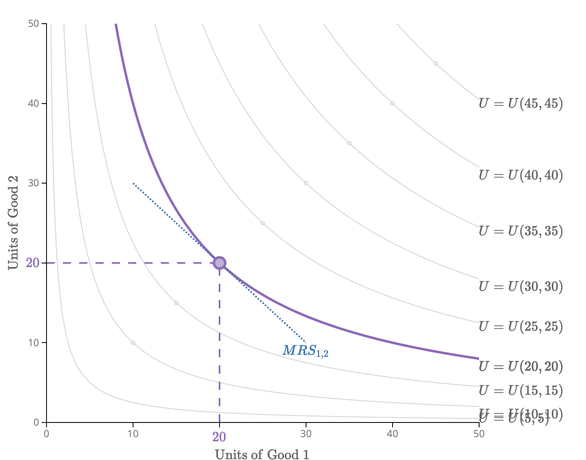

# 1. Econ2101: Microeconomics 2

Table of Contents

- [1. Econ2101: Microeconomics 2](#1-econ2101-microeconomics-2)
  - [1.1. Week 1: Preferences and Indifference Curves](#11-week-1-preferences-and-indifference-curves)
    - [1.1.1. Consumer Behaviour](#111-consumer-behaviour)
      - [1.1.1.1. __Tastes and Preferences__](#1111-tastes-and-preferences)
      - [1.1.1.2. __Indifference Curves__](#1112-indifference-curves)

## 1.1. Week 1: Preferences and Indifference Curves

### 1.1.1. Consumer Behaviour

#### 1.1.1.1. __Tastes and Preferences__

Preferences are assumed to be:  

- Complete
  
  - Are able to rank all possible bundles. Given a set (X) of goods = {A, B, C, D, E, F}, we can say that:

$$ \text{Given a set (}X\text{) of goods} = \{A, B, C, D, E, F\}\text{, we can say that:}\\ A \succ B \succ C \succ D \succ E \succ F \\ \text{where} \\ \succ \text{} = \text{ strictly preferred} \\ \succsim \text{} = \text{weakly preferred} \\ \sim \text{} = \text{indifferent}$$

- Transitive

  - Prefences are internally consistent.

$$ A \succ B \text{ and } B \succ C \\ \text{implies that} \\ A \succ C$$

- Monotonistic
  
  - More is better.

#### 1.1.1.2. __Indifference Curves__

An indifference curve shows all combinations of consumption that give the same level of satisfaction, consumers are assumed to be indifferent to points along the curve.

